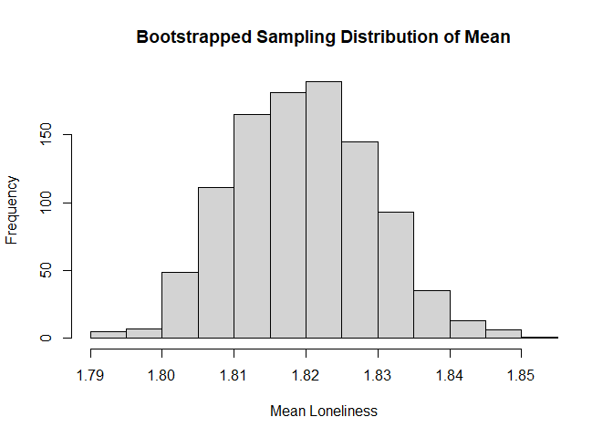
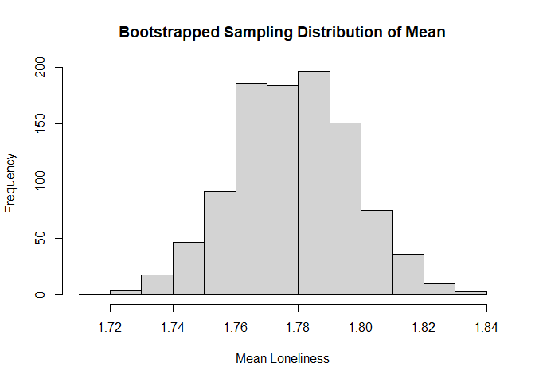
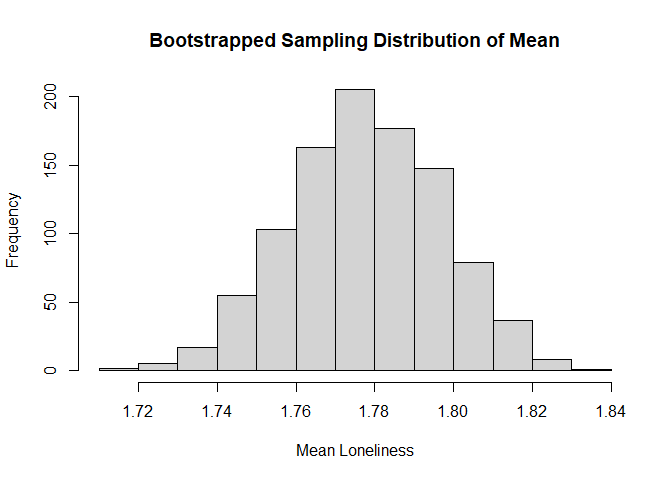
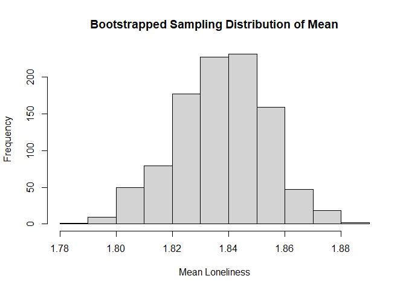
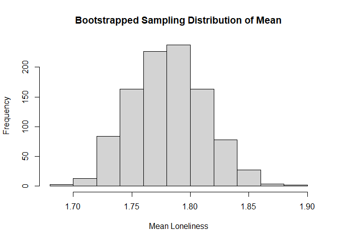

Lab6
================
Can Zhang
2024-10-10

# Load Packages and Dataset

``` r
library(haven)
library(dplyr)
```

    ## 
    ## Attaching package: 'dplyr'

    ## The following objects are masked from 'package:stats':
    ## 
    ##     filter, lag

    ## The following objects are masked from 'package:base':
    ## 
    ##     intersect, setdiff, setequal, union

``` r
library(ggplot2)
library(tidyr)
library(car)
```

    ## Loading required package: carData

    ## 
    ## Attaching package: 'car'

    ## The following object is masked from 'package:dplyr':
    ## 
    ##     recode

``` r
library(moments)
library(boot)
```

    ## 
    ## Attaching package: 'boot'

    ## The following object is masked from 'package:car':
    ## 
    ##     logit

``` r
load("C:/Users/User/Downloads/ICPSR_38964-V2/ICPSR_38964/DS0001/38964-0001-Data.rda")
dataset <- da38964.0001
rm(da38964.0001)
```

# Data Cleaning

``` r
#Select variables related to my research question
my_dataset <- dataset %>% select(RELIG_ATTEND, RELIG_IMP, RACEREC, LONELY_A, LONELY_B, LONELY_C)
my_dataset <- drop_na(my_dataset)
summary(my_dataset)
```

    ##                            RELIG_ATTEND                     RELIG_IMP   
    ##  (01) At least once a week       :1346   (1) Very important      :2564  
    ##  (02) About once or twice a month: 655   (2) Somewhat important  :2333  
    ##  (03) A few times                :1135   (3) Not too important   :1278  
    ##  (04) Once or twice              :1072   (4) Not at all important:1469  
    ##  (05) Never                      :3436                                  
    ##  (98) Don't Know                 :   0                                  
    ##                                                                         
    ##                                             RACEREC    
    ##  (01) Non-Hispanic White                        :4580  
    ##  (02) Non-Hispanic Black                        :1089  
    ##  (03) Non-Hispanic American Indian/Alaska Native: 103  
    ##  (04) Hispanic                                  :1387  
    ##  (05) Non-Hispanic Asian or Pacific Islander    : 393  
    ##  (06) Other and 2 or more races                 :  88  
    ##  (98) Don't know                                :   4  
    ##                   LONELY_A                     LONELY_B   
    ##  (01) Hardly ever     :3171   (01) Hardly ever     :2926  
    ##  (02) Some of the time:3036   (02) Some of the time:3197  
    ##  (03) Often           :1428   (03) Often           :1514  
    ##  (98) Don't Know      :   0   (98) Don't Know      :   0  
    ##  (99) Refusal         :   9   (99) Refusal         :   7  
    ##                                                           
    ##                                                           
    ##                   LONELY_C   
    ##  (01) Hardly ever     :2911  
    ##  (02) Some of the time:2949  
    ##  (03) Often           :1778  
    ##  (98) Don't Know      :   0  
    ##  (99) Refusal         :   6  
    ##                              
    ## 

``` r
#recode and composite the variables
my_dataset$RELIG_ATTEND <- 5 - as.numeric(my_dataset$RELIG_ATTEND)
my_dataset$RELIG_IMP <- 5 - as.numeric(my_dataset$RELIG_IMP)
my_dataset$RELIG_ENGAGEMENT <- (my_dataset$RELIG_ATTEND + my_dataset$RELIG_IMP) / 2

my_dataset$LONELY_A <- as.numeric(my_dataset$LONELY_A)
my_dataset$LONELY_B <- as.numeric(my_dataset$LONELY_B)
my_dataset$LONELY_C <- as.numeric(my_dataset$LONELY_C)
my_dataset$LONELY <- (my_dataset$LONELY_A + my_dataset$LONELY_B + my_dataset$LONELY_C) / 3
```

# Statistical Assumptions and Data Transformation

# Normality Assumption

``` r
# Check skewness and kurtosis
skewness(my_dataset$LONELY)
```

    ## [1] 0.3604909

``` r
kurtosis(my_dataset$LONELY)
```

    ## [1] 2.235807

``` r
# Bootstrap the mean for a group to see the sampling distribution
boot_mean <- function(data, indices) {
  d <- data[indices, ]  # Resample data with replacement
  return(mean(d$LONELY))  # Calculate mean of the 'LONELY' variable
}
my_group1 <- my_dataset[my_dataset$RACEREC == "(01) Non-Hispanic White", ]
boot_results1 <- boot(data = my_group1, statistic = boot_mean, R = 1000)
# Plot bootstrapped sampling distribution
hist(boot_results1$t, main = "Bootstrapped Sampling Distribution of Mean", xlab = "Mean Loneliness")
```

<!-- -->

``` r
my_group2 <- my_dataset[my_dataset$RACEREC == "(02) Non-Hispanic Black", ]
boot_results2 <- boot(data = my_group2, statistic = boot_mean, R = 1000)
hist(boot_results2$t, main = "Bootstrapped Sampling Distribution of Mean", xlab = "Mean Loneliness")
```

<!-- -->

``` r
my_group3 <- my_dataset[my_dataset$RACEREC == "(03) Non-Hispanic American Indian/Alaska Native
", ]
boot_results3 <- boot(data = my_group2, statistic = boot_mean, R = 1000)
hist(boot_results3$t, main = "Bootstrapped Sampling Distribution of Mean", xlab = "Mean Loneliness")
```

<!-- -->

``` r
my_group4 <- my_dataset[my_dataset$RACEREC == "(04) Hispanic", ]
boot_results4 <- boot(data = my_group4, statistic = boot_mean, R = 1000)
hist(boot_results4$t, main = "Bootstrapped Sampling Distribution of Mean", xlab = "Mean Loneliness")
```

<!-- -->

``` r
my_group5 <- my_dataset[my_dataset$RACEREC == "(05) Non-Hispanic Asian or Pacific Islander", ]
boot_results5 <- boot(data = my_group5, statistic = boot_mean, R = 1000)
hist(boot_results5$t, main = "Bootstrapped Sampling Distribution of Mean", xlab = "Mean Loneliness")
```

<!-- --> The data
distribution is generally normal, given that the skewness is not
significantly deviant from 0 and kurtosis is not significantly deviant
from 3. Moreover, the distribution of the sampling distribution of the
mean for each group is generally normal from the histogram. Therefore,
the normality assumption is generally fulfilled.

# Equal Variance Assumption

``` r
leveneTest(LONELY ~ RACEREC, data = my_dataset)
```

    ## Levene's Test for Homogeneity of Variance (center = median)
    ##         Df F value Pr(>F)
    ## group    6  1.3081 0.2495
    ##       7637

The Levene’s Test result is not significant, indicating that the
variance is equal across groups (assumption is met).
