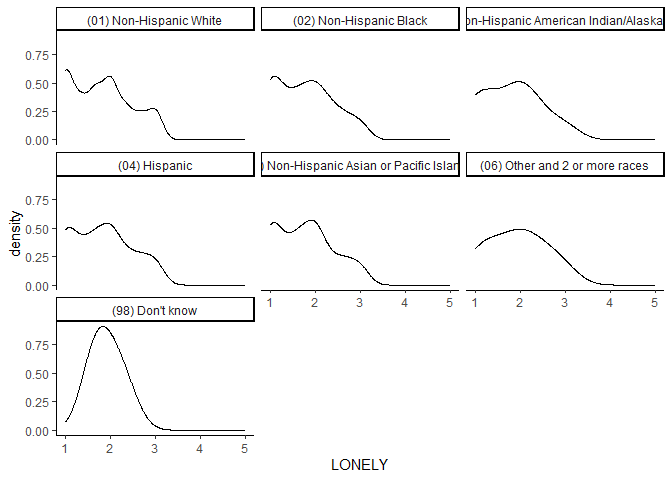

My Project
================
Can Zhang
2024-10-10

# Load Packages and Dataset

``` r
library(haven)
library(dplyr)
```

    ## 
    ## Attaching package: 'dplyr'

    ## The following objects are masked from 'package:stats':
    ## 
    ##     filter, lag

    ## The following objects are masked from 'package:base':
    ## 
    ##     intersect, setdiff, setequal, union

``` r
library(ggplot2)
library(tidyr)
library(car)
```

    ## Loading required package: carData

    ## 
    ## Attaching package: 'car'

    ## The following object is masked from 'package:dplyr':
    ## 
    ##     recode

``` r
library(moments)
library(boot)
```

    ## 
    ## Attaching package: 'boot'

    ## The following object is masked from 'package:car':
    ## 
    ##     logit

``` r
load("C:/Users/User/Downloads/ICPSR_38964-V2/ICPSR_38964/DS0001/38964-0001-Data.rda")
dataset <- da38964.0001
rm(da38964.0001)
```

# Data Cleaning

``` r
#Select variables related to my research question
my_dataset <- dataset %>% select(RELIG_ATTEND, RELIG_IMP, RACEREC, LONELY_A, LONELY_B, LONELY_C)
my_dataset <- drop_na(my_dataset)
summary(my_dataset)
```

    ##                            RELIG_ATTEND                     RELIG_IMP   
    ##  (01) At least once a week       :1346   (1) Very important      :2564  
    ##  (02) About once or twice a month: 655   (2) Somewhat important  :2333  
    ##  (03) A few times                :1135   (3) Not too important   :1278  
    ##  (04) Once or twice              :1072   (4) Not at all important:1469  
    ##  (05) Never                      :3436                                  
    ##  (98) Don't Know                 :   0                                  
    ##                                                                         
    ##                                             RACEREC    
    ##  (01) Non-Hispanic White                        :4580  
    ##  (02) Non-Hispanic Black                        :1089  
    ##  (03) Non-Hispanic American Indian/Alaska Native: 103  
    ##  (04) Hispanic                                  :1387  
    ##  (05) Non-Hispanic Asian or Pacific Islander    : 393  
    ##  (06) Other and 2 or more races                 :  88  
    ##  (98) Don't know                                :   4  
    ##                   LONELY_A                     LONELY_B   
    ##  (01) Hardly ever     :3171   (01) Hardly ever     :2926  
    ##  (02) Some of the time:3036   (02) Some of the time:3197  
    ##  (03) Often           :1428   (03) Often           :1514  
    ##  (98) Don't Know      :   0   (98) Don't Know      :   0  
    ##  (99) Refusal         :   9   (99) Refusal         :   7  
    ##                                                           
    ##                                                           
    ##                   LONELY_C   
    ##  (01) Hardly ever     :2911  
    ##  (02) Some of the time:2949  
    ##  (03) Often           :1778  
    ##  (98) Don't Know      :   0  
    ##  (99) Refusal         :   6  
    ##                              
    ## 

``` r
#recode and composite the variables
my_dataset$RELIG_ATTEND <- 5 - as.numeric(my_dataset$RELIG_ATTEND)
my_dataset$RELIG_IMP <- 5 - as.numeric(my_dataset$RELIG_IMP)
my_dataset$RELIG_ENGAGEMENT <- (my_dataset$RELIG_ATTEND + my_dataset$RELIG_IMP) / 2

my_dataset$LONELY_A <- as.numeric(my_dataset$LONELY_A)
my_dataset$LONELY_B <- as.numeric(my_dataset$LONELY_B)
my_dataset$LONELY_C <- as.numeric(my_dataset$LONELY_C)
my_dataset$LONELY <- (my_dataset$LONELY_A + my_dataset$LONELY_B + my_dataset$LONELY_C) / 3
```

# Statistical Assumptions and Data Transformation

# Normality Assumption

``` r
# Check the dependent variable loneliness
# Density plot of loneliness
ggplot(my_dataset, aes(x = LONELY)) + geom_density(adjust = 1.5) + facet_wrap(~RACEREC) + theme_classic()
```

<!-- -->

``` r
# Check the independent variable religious engagement
# Skewness and kurtosis for religious engagement
skewness(my_dataset$RELIG_ENGAGEMENT)
```

    ## [1] 0.2339312

``` r
kurtosis(my_dataset$RELIG_ENGAGEMENT)
```

    ## [1] 1.830046

The distribution of loneliness is positively skewed, as indicated by the
density plot showing a positive skew.

The distribution of religious engagement is slightly less concentrated
around the mean and has fewer extreme values in the tails compared to a
normal distribution, as the kurtosis is lower than 3 (1.83). However,
since the sample size is large enough, it is generally acceptable to
have such kurtosis.

# Equal Variance Assumption

``` r
leveneTest(LONELY ~ RACEREC, data = my_dataset)
```

    ## Levene's Test for Homogeneity of Variance (center = median)
    ##         Df F value Pr(>F)
    ## group    6  1.3081 0.2495
    ##       7637

The Levene’s Test result is not significant, indicating that the
variance is equal across groups (assumption is met).

# Data Transformation

``` r
my_dataset$LONELY_log <- log(my_dataset$LONELY)

ggplot(my_dataset, aes(x = LONELY_log)) + geom_density(adjust = 1.5) + facet_wrap(~RACEREC) + theme_classic()
```

<!-- -->

After the log transformation, the data distribution of loneliness is
generally normal, according to the density plot.
