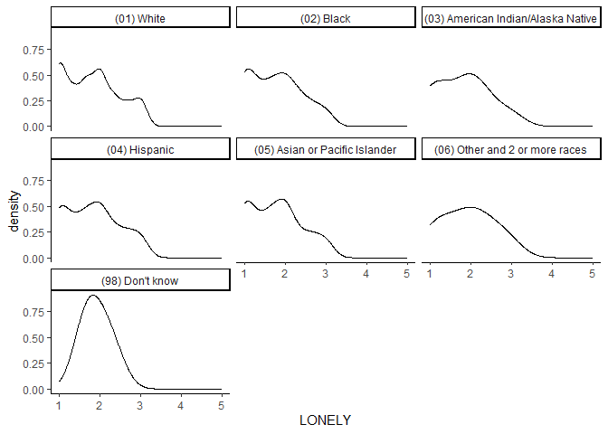
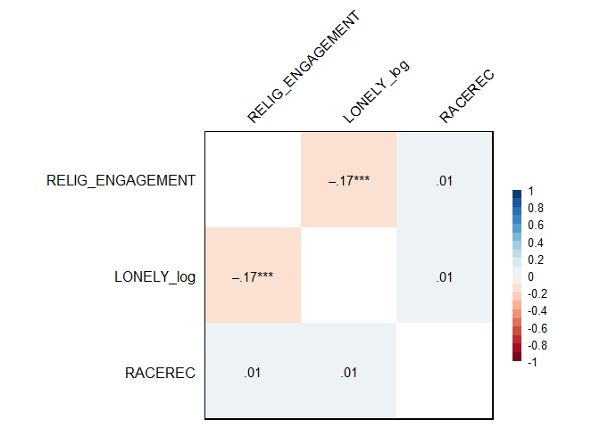
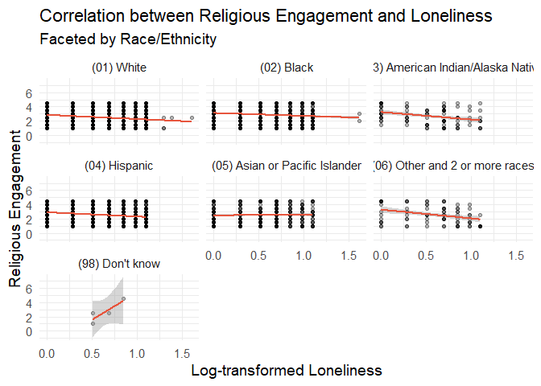
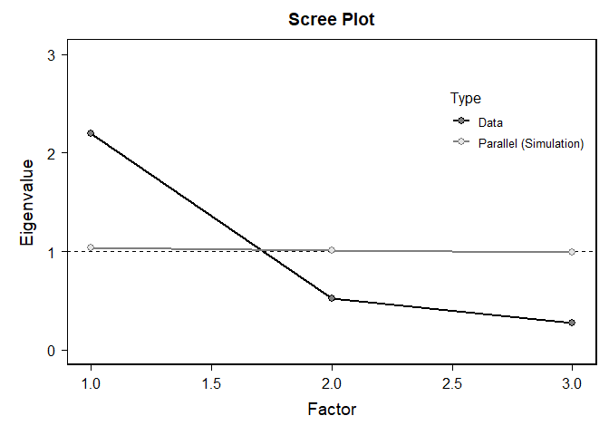

My Project
================
Can Zhang
2024-10-24

# Load Packages and Dataset

``` r
library(haven)
library(dplyr)
```

    ## 
    ## Attaching package: 'dplyr'

    ## The following objects are masked from 'package:stats':
    ## 
    ##     filter, lag

    ## The following objects are masked from 'package:base':
    ## 
    ##     intersect, setdiff, setequal, union

``` r
library(ggplot2)
library(tidyr)
library(car)
```

    ## Loading required package: carData

    ## 
    ## Attaching package: 'car'

    ## The following object is masked from 'package:dplyr':
    ## 
    ##     recode

``` r
library(moments)
library(boot)
```

    ## 
    ## Attaching package: 'boot'

    ## The following object is masked from 'package:car':
    ## 
    ##     logit

``` r
library(bruceR)
```

    ## 
    ## bruceR (v2024.6)
    ## Broadly Useful Convenient and Efficient R functions
    ## 
    ## Packages also loaded:
    ## ✔ data.table ✔ emmeans
    ## ✔ dplyr      ✔ lmerTest
    ## ✔ tidyr      ✔ effectsize
    ## ✔ stringr    ✔ performance
    ## ✔ ggplot2    ✔ interactions
    ## 
    ## Main functions of `bruceR`:
    ## cc()             Describe()  TTEST()
    ## add()            Freq()      MANOVA()
    ## .mean()          Corr()      EMMEANS()
    ## set.wd()         Alpha()     PROCESS()
    ## import()         EFA()       model_summary()
    ## print_table()    CFA()       lavaan_summary()
    ## 
    ## For full functionality, please install all dependencies:
    ## install.packages("bruceR", dep=TRUE)
    ## 
    ## Online documentation:
    ## https://psychbruce.github.io/bruceR
    ## 
    ## To use this package in publications, please cite:
    ## Bao, H.-W.-S. (2024). bruceR: Broadly useful convenient and efficient R functions (Version 2024.6) [Computer software]. https://CRAN.R-project.org/package=bruceR

    ## 
    ## These packages are dependencies of `bruceR` but not installed:
    ## - pacman, openxlsx, ggtext, lmtest, vars, phia, MuMIn, GGally
    ## 
    ## ***** Install all dependencies *****
    ## install.packages("bruceR", dep=TRUE)

``` r
load("C:/Users/User/Downloads/ICPSR_38964-V2/ICPSR_38964/DS0001/38964-0001-Data.rda")
dataset <- da38964.0001
rm(da38964.0001)
```

# Data Cleaning

``` r
#Select variables related to my research question
my_dataset <- dataset %>% select(RELIG_ATTEND, RELIG_IMP, RACEREC, LONELY_A, LONELY_B, LONELY_C)
my_dataset <- drop_na(my_dataset)
summary(my_dataset)
```

    ##                            RELIG_ATTEND                     RELIG_IMP   
    ##  (01) At least once a week       :1346   (1) Very important      :2564  
    ##  (02) About once or twice a month: 655   (2) Somewhat important  :2333  
    ##  (03) A few times                :1135   (3) Not too important   :1278  
    ##  (04) Once or twice              :1072   (4) Not at all important:1469  
    ##  (05) Never                      :3436                                  
    ##  (98) Don't Know                 :   0                                  
    ##                                                                         
    ##                                             RACEREC    
    ##  (01) Non-Hispanic White                        :4580  
    ##  (02) Non-Hispanic Black                        :1089  
    ##  (03) Non-Hispanic American Indian/Alaska Native: 103  
    ##  (04) Hispanic                                  :1387  
    ##  (05) Non-Hispanic Asian or Pacific Islander    : 393  
    ##  (06) Other and 2 or more races                 :  88  
    ##  (98) Don't know                                :   4  
    ##                   LONELY_A                     LONELY_B   
    ##  (01) Hardly ever     :3171   (01) Hardly ever     :2926  
    ##  (02) Some of the time:3036   (02) Some of the time:3197  
    ##  (03) Often           :1428   (03) Often           :1514  
    ##  (98) Don't Know      :   0   (98) Don't Know      :   0  
    ##  (99) Refusal         :   9   (99) Refusal         :   7  
    ##                                                           
    ##                                                           
    ##                   LONELY_C   
    ##  (01) Hardly ever     :2911  
    ##  (02) Some of the time:2949  
    ##  (03) Often           :1778  
    ##  (98) Don't Know      :   0  
    ##  (99) Refusal         :   6  
    ##                              
    ## 

``` r
#recode and composite the variables
my_dataset$RELIG_ATTEND <- 6 - as.numeric(my_dataset$RELIG_ATTEND)
my_dataset$RELIG_IMP <- 5 - as.numeric(my_dataset$RELIG_IMP)
my_dataset$RELIG_ENGAGEMENT <- (my_dataset$RELIG_ATTEND + my_dataset$RELIG_IMP) / 2

my_dataset$LONELY_A <- as.numeric(my_dataset$LONELY_A)
my_dataset$LONELY_B <- as.numeric(my_dataset$LONELY_B)
my_dataset$LONELY_C <- as.numeric(my_dataset$LONELY_C)
my_dataset$LONELY <- (my_dataset$LONELY_A + my_dataset$LONELY_B + my_dataset$LONELY_C) / 3
```

# Statistical Assumptions and Data Transformation

# Normality Assumption

``` r
# Check the dependent variable loneliness
# Density plot of loneliness
ggplot(my_dataset, aes(x = LONELY)) + geom_density(adjust = 1.5) + facet_wrap(~RACEREC) + theme_classic()
```

<!-- -->

``` r
# Check the independent variable religious engagement
# Skewness and kurtosis for religious engagement
skewness(my_dataset$RELIG_ENGAGEMENT)
```

    ## [1] 0.2339312

``` r
kurtosis(my_dataset$RELIG_ENGAGEMENT)
```

    ## [1] 1.830046

The distribution of loneliness is positively skewed, as indicated by the
density plot showing a positive skew.

The distribution of religious engagement is slightly less concentrated
around the mean and has fewer extreme values in the tails compared to a
normal distribution, as the kurtosis is lower than 3 (1.83). However,
since the sample size is large enough, it is generally acceptable to
have such kurtosis.

# Equal Variance Assumption

``` r
leveneTest(LONELY ~ RACEREC, data = my_dataset)
```

    ## Levene's Test for Homogeneity of Variance (center = median)
    ##         Df F value Pr(>F)
    ## group    6  1.3081 0.2495
    ##       7637

The Levene’s Test result is not significant, indicating that the
variance is equal across groups (assumption is met).

# Data Transformation

``` r
my_dataset$LONELY_log <- log(my_dataset$LONELY)

ggplot(my_dataset, aes(x = LONELY_log)) + geom_density(adjust = 1.5) + facet_wrap(~RACEREC) + theme_classic()
```

<!-- -->

After the log transformation, the data distribution of loneliness is
generally normal, according to the density plot.

# Data Analysis

``` r
cor_data <- my_dataset %>% select(RELIG_ENGAGEMENT, LONELY_log, RACEREC)
Corr(cor_data)
```

    ## NOTE: `RACEREC` transformed to numeric.
    ## 
    ## Pearson's r and 95% confidence intervals:
    ## ────────────────────────────────────────────────────────────────
    ##                                  r       [95% CI]     p        N
    ## ────────────────────────────────────────────────────────────────
    ## RELIG_ENGAGEMENT-LONELY_log  -0.17 [-0.19, -0.15] <.001 *** 7644
    ## RELIG_ENGAGEMENT-RACEREC      0.01 [-0.01,  0.04]  .240     7644
    ## LONELY_log-RACEREC            0.01 [-0.01,  0.03]  .411     7644
    ## ────────────────────────────────────────────────────────────────

<!-- -->

    ## Correlation matrix is displayed in the RStudio `Plots` Pane.

``` r
PROCESS(my_dataset, y = "LONELY_log", x = "RELIG_ENGAGEMENT", mods = c("RACEREC"))
```

    ## 
    ## ****************** PART 1. Regression Model Summary ******************
    ## 
    ## PROCESS Model Code : 1 (Hayes, 2018; www.guilford.com/p/hayes3)
    ## PROCESS Model Type : Simple Moderation
    ## -    Outcome (Y) : LONELY_log
    ## -  Predictor (X) : RELIG_ENGAGEMENT
    ## -  Mediators (M) : -
    ## - Moderators (W) : RACEREC
    ## - Covariates (C) : -
    ## -   HLM Clusters : -
    ## 
    ## All numeric predictors have been grand-mean centered.
    ## (For details, please see the help page of PROCESS.)
    ## 
    ## Formula of Outcome:
    ## -    LONELY_log ~ RELIG_ENGAGEMENT*RACEREC
    ## 
    ## CAUTION:
    ##   Fixed effect (coef.) of a predictor involved in an interaction
    ##   denotes its "simple effect/slope" at the other predictor = 0.
    ##   Only when all predictors in an interaction are mean-centered
    ##   can the fixed effect denote the "main effect"!
    ##   
    ## Model Summary
    ## 
    ## ───────────────────────────────────────────────────────────────────────────────────────────────────────
    ##                                                                          (1) LONELY_log  (2) LONELY_log
    ## ───────────────────────────────────────────────────────────────────────────────────────────────────────
    ## (Intercept)                                                                 0.531 ***       0.528 ***  
    ##                                                                            (0.004)         (0.005)     
    ## RELIG_ENGAGEMENT                                                           -0.053 ***      -0.056 ***  
    ##                                                                            (0.004)         (0.004)     
    ## RACEREC(02) Non-Hispanic Black                                                             -0.004      
    ##                                                                                            (0.013)     
    ## RACEREC(03) Non-Hispanic American Indian/Alaska Native                                      0.007      
    ##                                                                                            (0.036)     
    ## RACEREC(04) Hispanic                                                                        0.016      
    ##                                                                                            (0.011)     
    ## RACEREC(05) Non-Hispanic Asian or Pacific Islander                                         -0.013      
    ##                                                                                            (0.019)     
    ## RACEREC(06) Other and 2 or more races                                                       0.055      
    ##                                                                                            (0.039)     
    ## RACEREC(98) Don't know                                                                      0.109      
    ##                                                                                            (0.182)     
    ## RELIG_ENGAGEMENT:RACEREC(02) Non-Hispanic Black                                             0.010      
    ##                                                                                            (0.011)     
    ## RELIG_ENGAGEMENT:RACEREC(03) Non-Hispanic American Indian/Alaska Native                    -0.058      
    ##                                                                                            (0.033)     
    ## RELIG_ENGAGEMENT:RACEREC(04) Hispanic                                                      -0.004      
    ##                                                                                            (0.010)     
    ## RELIG_ENGAGEMENT:RACEREC(05) Non-Hispanic Asian or Pacific Islander                         0.066 ***  
    ##                                                                                            (0.016)     
    ## RELIG_ENGAGEMENT:RACEREC(06) Other and 2 or more races                                     -0.045      
    ##                                                                                            (0.032)     
    ## RELIG_ENGAGEMENT:RACEREC(98) Don't know                                                     0.154      
    ##                                                                                            (0.146)     
    ## ───────────────────────────────────────────────────────────────────────────────────────────────────────
    ## R^2                                                                         0.029           0.033      
    ## Adj. R^2                                                                    0.029           0.031      
    ## Num. obs.                                                                7644            7644          
    ## ───────────────────────────────────────────────────────────────────────────────────────────────────────
    ## Note. * p < .05, ** p < .01, *** p < .001.
    ## 
    ## ************ PART 2. Mediation/Moderation Effect Estimate ************
    ## 
    ## Package Use : ‘interactions’ (v1.2.0)
    ## Effect Type : Simple Moderation (Model 1)
    ## Sample Size : 7644
    ## Random Seed : -
    ## Simulations : -
    ## 
    ## Interaction Effect on "LONELY_log" (Y)
    ## ───────────────────────────────────────────────────
    ##                                F df1  df2     p    
    ## ───────────────────────────────────────────────────
    ## RELIG_ENGAGEMENT * RACEREC  4.15   6 7630 <.001 ***
    ## ───────────────────────────────────────────────────
    ## 
    ## Simple Slopes: "RELIG_ENGAGEMENT" (X) ==> "LONELY_log" (Y)
    ## ──────────────────────────────────────────────────────────────────────────────────────────────────
    ##  "RACEREC"                                       Effect    S.E.       t     p             [95% CI]
    ## ──────────────────────────────────────────────────────────────────────────────────────────────────
    ##  (01) Non-Hispanic White                         -0.056 (0.004) -12.517 <.001 *** [-0.064, -0.047]
    ##  (02) Non-Hispanic Black                         -0.045 (0.010)  -4.527 <.001 *** [-0.065, -0.026]
    ##  (03) Non-Hispanic American Indian/Alaska Native -0.114 (0.032)  -3.535 <.001 *** [-0.177, -0.051]
    ##  (04) Hispanic                                   -0.060 (0.009)  -7.013 <.001 *** [-0.077, -0.043]
    ##  (05) Non-Hispanic Asian or Pacific Islander      0.011 (0.016)   0.673  .501     [-0.020,  0.041]
    ##  (06) Other and 2 or more races                  -0.100 (0.031)  -3.203  .001 **  [-0.162, -0.039]
    ##  (98) Don't know                                  0.098 (0.146)   0.673  .501     [-0.188,  0.384]
    ## ──────────────────────────────────────────────────────────────────────────────────────────────────

# Visualize the Results

``` r
ggplot(cor_data, aes(x = LONELY_log, y = RELIG_ENGAGEMENT)) + geom_point() + geom_smooth() + theme_bruce()
```

    ## `geom_smooth()` using method = 'gam' and formula = 'y ~ s(x, bs = "cs")'

<!-- -->

``` r
ggplot(cor_data, aes(x = LONELY_log, y = RELIG_ENGAGEMENT)) + geom_point() + geom_smooth(method = "lm") + theme_bruce() + facet_wrap(~RACEREC)
```

    ## `geom_smooth()` using formula = 'y ~ x'

<!-- -->

# Reliability and Factor Analysis

``` r
# Cronbach's Alpha
Alpha(my_dataset, vars = c("LONELY_A", "LONELY_B", "LONELY_C"))
```

    ## 
    ## Reliability Analysis
    ## 
    ## Summary:
    ## Total Items: 3
    ## Scale Range: 1 ~ 5
    ## Total Cases: 7644
    ## Valid Cases: 7644 (100.0%)
    ## 
    ## Scale Statistics:
    ## Mean = 1.816
    ## S.D. = 0.647
    ## Cronbach’s α = 0.816
    ## McDonald’s ω = 0.823
    ## 
    ## Item Statistics (Cronbach’s α If Item Deleted):
    ## ───────────────────────────────────────────────────
    ##            Mean    S.D. Item-Rest Cor. Cronbach’s α
    ## ───────────────────────────────────────────────────
    ## LONELY_A  1.776 (0.750)          0.575        0.838
    ## LONELY_B  1.818 (0.746)          0.721        0.692
    ## LONELY_C  1.854 (0.774)          0.712        0.699
    ## ───────────────────────────────────────────────────
    ## Item-Rest Cor. = Corrected Item-Total Correlation

``` r
# Factor Analysis
EFA(my_dataset, vars = c("LONELY_A", "LONELY_B", "LONELY_C"), method = "pa", plot.scree = TRUE, nfactors = c("parallel"))
```

    ## 
    ## Explanatory Factor Analysis
    ## 
    ## Summary:
    ## Total Items: 3
    ## Scale Range: 1 ~ 5
    ## Total Cases: 7644
    ## Valid Cases: 7644 (100.0%)
    ## 
    ## Extraction Method:
    ## - Principal Axis Factor Analysis
    ## Rotation Method:
    ## - (Only one component was extracted. The solution was not rotated.)
    ## 
    ## KMO and Bartlett's Test:
    ## - Kaiser-Meyer-Olkin (KMO) Measure of Sampling Adequacy: MSA = 0.685
    ## - Bartlett's Test of Sphericity: Approx. χ²(3) = 8672.59, p < 1e-99 ***
    ## 
    ## Total Variance Explained:
    ## ───────────────────────────────────────────────────────────────────────────────
    ##           Eigenvalue Variance % Cumulative % SS Loading Variance % Cumulative %
    ## ───────────────────────────────────────────────────────────────────────────────
    ## Factor 1       2.196     73.212       73.212      1.836     61.185       61.185
    ## Factor 2       0.525     17.492       90.704                                   
    ## Factor 3       0.279      9.296      100.000                                   
    ## ───────────────────────────────────────────────────────────────────────────────
    ## 
    ## Factor Loadings (Sorted by Size):
    ## ───────────────────────────
    ##             PA1 Communality
    ## ───────────────────────────
    ## LONELY_B  0.855       0.730
    ## LONELY_C  0.843       0.710
    ## LONELY_A  0.629       0.395
    ## ───────────────────────────
    ## Communality = Sum of Squared (SS) Factor Loadings
    ## (Uniqueness = 1 - Communality)

<!-- -->

``` r
# Spearman's Rho
spearman_rho <- cor(my_dataset$RELIG_ATTEND, my_dataset$RELIG_IMP, method = "spearman")
print(spearman_rho)
```

    ## [1] 0.600681

# Exploratory Questions

How do education affect the relationship between religious engagement
and loneliness?

``` r
my_dataset$EDUC <- dataset$EDUC
summary(my_dataset$EDUC)
```

    ##                              (1) Did not complete high school 
    ##                                                           374 
    ##                                (2) High school diploma or GED 
    ##                                                          2435 
    ##            (3) Attended college but did not complete a degree 
    ##                                                          1802 
    ##                                          (4) Associate degree 
    ##                                                           988 
    ##                                         (5) Bachelor's degree 
    ##                                                          1397 
    ## (6) Post-Bachelor's degree (e.g., Masters, Doctorate, MD, JD) 
    ##                                                           648

``` r
leveneTest(LONELY_log ~ EDUC, data = my_dataset)
```

    ## Levene's Test for Homogeneity of Variance (center = median)
    ##         Df F value  Pr(>F)  
    ## group    5  2.8827 0.01324 *
    ##       7638                  
    ## ---
    ## Signif. codes:  0 '***' 0.001 '**' 0.01 '*' 0.05 '.' 0.1 ' ' 1

``` r
my_dataset$LONELY_sqrt <- sqrt(my_dataset$LONELY)
leveneTest(LONELY_sqrt ~ EDUC, data = my_dataset)
```

    ## Levene's Test for Homogeneity of Variance (center = median)
    ##         Df F value  Pr(>F)  
    ## group    5  2.0588 0.06745 .
    ##       7638                  
    ## ---
    ## Signif. codes:  0 '***' 0.001 '**' 0.01 '*' 0.05 '.' 0.1 ' ' 1

``` r
skewness(my_dataset$LONELY_sqrt)
```

    ## [1] 0.1014501

``` r
kurtosis(my_dataset$LONELY_sqrt)
```

    ## [1] 1.937552

``` r
cor_data1 <- my_dataset %>% select(RELIG_ENGAGEMENT, LONELY_sqrt, EDUC)
Corr(cor_data1)
```

    ## NOTE: `EDUC` transformed to numeric.
    ## 
    ## Pearson's r and 95% confidence intervals:
    ## ─────────────────────────────────────────────────────────────────
    ##                                   r       [95% CI]     p        N
    ## ─────────────────────────────────────────────────────────────────
    ## RELIG_ENGAGEMENT-LONELY_sqrt  -0.17 [-0.20, -0.15] <.001 *** 7644
    ## RELIG_ENGAGEMENT-EDUC          0.13 [ 0.11,  0.15] <.001 *** 7644
    ## LONELY_sqrt-EDUC              -0.12 [-0.14, -0.10] <.001 *** 7644
    ## ─────────────────────────────────────────────────────────────────

<!-- -->

    ## Correlation matrix is displayed in the RStudio `Plots` Pane.

``` r
PROCESS(my_dataset, y = "LONELY_sqrt", x = "RELIG_ENGAGEMENT", mods = c("EDUC"))
```

    ## 
    ## ****************** PART 1. Regression Model Summary ******************
    ## 
    ## PROCESS Model Code : 1 (Hayes, 2018; www.guilford.com/p/hayes3)
    ## PROCESS Model Type : Simple Moderation
    ## -    Outcome (Y) : LONELY_sqrt
    ## -  Predictor (X) : RELIG_ENGAGEMENT
    ## -  Mediators (M) : -
    ## - Moderators (W) : EDUC
    ## - Covariates (C) : -
    ## -   HLM Clusters : -
    ## 
    ## All numeric predictors have been grand-mean centered.
    ## (For details, please see the help page of PROCESS.)
    ## 
    ## Formula of Outcome:
    ## -    LONELY_sqrt ~ RELIG_ENGAGEMENT*EDUC
    ## 
    ## CAUTION:
    ##   Fixed effect (coef.) of a predictor involved in an interaction
    ##   denotes its "simple effect/slope" at the other predictor = 0.
    ##   Only when all predictors in an interaction are mean-centered
    ##   can the fixed effect denote the "main effect"!
    ##   
    ## Model Summary
    ## 
    ## ────────────────────────────────────────────────────────────────────────────────────────────────────────────────────
    ##                                                                                     (1) LONELY_sqrt  (2) LONELY_sqrt
    ## ────────────────────────────────────────────────────────────────────────────────────────────────────────────────────
    ## (Intercept)                                                                            1.326 ***        1.386 ***   
    ##                                                                                       (0.003)          (0.012)      
    ## RELIG_ENGAGEMENT                                                                      -0.035 ***       -0.042 ***   
    ##                                                                                       (0.002)          (0.012)      
    ## EDUC(2) High school diploma or GED                                                                     -0.046 ***   
    ##                                                                                                        (0.013)      
    ## EDUC(3) Attended college but did not complete a degree                                                 -0.045 ***   
    ##                                                                                                        (0.014)      
    ## EDUC(4) Associate degree                                                                               -0.064 ***   
    ##                                                                                                        (0.015)      
    ## EDUC(5) Bachelor's degree                                                                              -0.097 ***   
    ##                                                                                                        (0.014)      
    ## EDUC(6) Post-Bachelor's degree (e.g., Masters, Doctorate, MD, JD)                                      -0.097 ***   
    ##                                                                                                        (0.016)      
    ## RELIG_ENGAGEMENT:EDUC(2) High school diploma or GED                                                     0.011       
    ##                                                                                                        (0.012)      
    ## RELIG_ENGAGEMENT:EDUC(3) Attended college but did not complete a degree                                 0.010       
    ##                                                                                                        (0.013)      
    ## RELIG_ENGAGEMENT:EDUC(4) Associate degree                                                               0.005       
    ##                                                                                                        (0.013)      
    ## RELIG_ENGAGEMENT:EDUC(5) Bachelor's degree                                                              0.012       
    ##                                                                                                        (0.013)      
    ## RELIG_ENGAGEMENT:EDUC(6) Post-Bachelor's degree (e.g., Masters, Doctorate, MD, JD)                      0.007       
    ##                                                                                                        (0.014)      
    ## ────────────────────────────────────────────────────────────────────────────────────────────────────────────────────
    ## R^2                                                                                    0.030            0.042       
    ## Adj. R^2                                                                               0.030            0.040       
    ## Num. obs.                                                                           7644             7644           
    ## ────────────────────────────────────────────────────────────────────────────────────────────────────────────────────
    ## Note. * p < .05, ** p < .01, *** p < .001.
    ## 
    ## ************ PART 2. Mediation/Moderation Effect Estimate ************
    ## 
    ## Package Use : ‘interactions’ (v1.2.0)
    ## Effect Type : Simple Moderation (Model 1)
    ## Sample Size : 7644
    ## Random Seed : -
    ## Simulations : -
    ## 
    ## Interaction Effect on "LONELY_sqrt" (Y)
    ## ────────────────────────────────────────────────
    ##                             F df1  df2     p    
    ## ────────────────────────────────────────────────
    ## RELIG_ENGAGEMENT * EDUC  0.35   5 7632  .884    
    ## ────────────────────────────────────────────────
    ## 
    ## Simple Slopes: "RELIG_ENGAGEMENT" (X) ==> "LONELY_sqrt" (Y)
    ## ───────────────────────────────────────────────────────────────────────────────────────────────────────────────
    ##  "EDUC"                                                        Effect    S.E.      t     p             [95% CI]
    ## ───────────────────────────────────────────────────────────────────────────────────────────────────────────────
    ##  (1) Did not complete high school                              -0.042 (0.012) -3.625 <.001 *** [-0.065, -0.019]
    ##  (2) High school diploma or GED                                -0.031 (0.004) -7.262 <.001 *** [-0.040, -0.023]
    ##  (3) Attended college but did not complete a degree            -0.032 (0.005) -6.730 <.001 *** [-0.041, -0.023]
    ##  (4) Associate degree                                          -0.037 (0.006) -5.848 <.001 *** [-0.050, -0.025]
    ##  (5) Bachelor's degree                                         -0.030 (0.005) -5.939 <.001 *** [-0.040, -0.020]
    ##  (6) Post-Bachelor's degree (e.g., Masters, Doctorate, MD, JD) -0.035 (0.007) -4.696 <.001 *** [-0.050, -0.020]
    ## ───────────────────────────────────────────────────────────────────────────────────────────────────────────────
