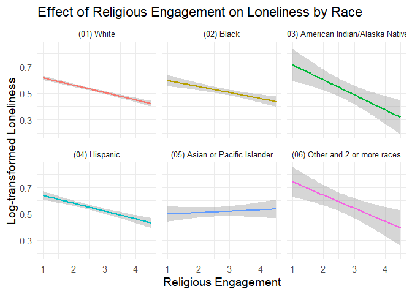
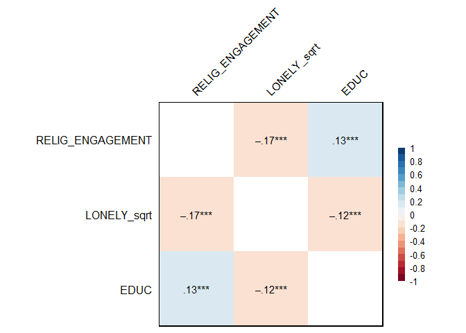
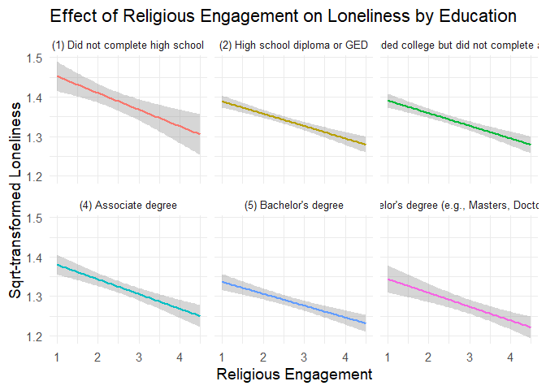

# How Religion Reduces Loneliness Across Races

## Objectives
The purpose of this project is to examine the relationship between religious involvement and self-perceived loneliness, with a particular focus on how race and ethnicity mediate this relationship. Loneliness is an important public health issue that is strongly associated with poor physical and mental health outcomes. Religious involvement, such as attending worship services or spiritual practices, is widely recognized for its role in fostering social connectedness and emotional recovery, which can reduce loneliness and improve overall health. Nonetheless, the effects of religion on loneliness are not uniform. The impact of religion on loneliness may vary across racial and ethnic communities due to differences in social support structures and cultural expectations associated with religious practice. Understanding these differences is critical to developing inclusive and effective interventions to address loneliness in diverse populations.

However, prior studies on this topic have either overlooked the role of race entirely or focused narrowly on specific minority groups, leaving a critical gap in understanding how religious engagement affects loneliness across a multiracial population. This study aims to fill this gap by analyzing data from a large, racially diverse sample, providing a comprehensive perspective on the interplay of religion, race, and loneliness. By investigating this underexplored area, the project provides a foundation for designing more equitable and effective mental health strategies that account for the intersectionality of religion, race, and loneliness. This study underscores the importance of adopting a holistic approach to understanding and addressing mental health disparities in diverse communities.
  
This project seeks to answer the question: How does religious engagement influence self-perceived loneliness, and to what extent does race/ethnicity moderate this relationship? By examining a multiracial sample, this study aims to uncover variations in how religious involvement impacts loneliness across different racial and ethnic groups.

## Approach
### Dataset
This project utilizes data from [National Wellbeing Survey, United States, 2022](https://www.icpsr.umich.edu/web/ICPSR/studies/38964/summary), a large, open-source dataset designed to assess various aspects of mental health and well-being among adults in the United States. The data were collected through a web-based survey. The dataset includes a sample of 7,644 participants aged 18 to 64, with a mean age of 41.05 years. The participants represent a diverse racial and ethnic composition and were selected through a cross-sectional study design. Approximately 25.2% of the participants reside in rural areas, and 48% are male. The racial composition of the participants is shown in the graph below.
  

  
### Variables and Analytic Method
| Variable Name | Measuring Items | Validity |
| --- | --- | --- |
| **Religious Engagement** | 1. Religious Service Attendence (1 = Never; 5 = At least once a week)   2. Religious Importance (1 = Not at all important; 4 = Very important) | Spearman’s rho = .60 |
| **Loneliness** | 1. "Lack companionship"   2. "Feel left out"   3. "Feel isolated from others"   (1 = Hardly ever; 3 = Often) | Cronbach’s alpha = .82   Factor loadings: .63-.86 |
| **Race/Ethnicity** | / | / |

To address the research question, this project employs **correlation analyses** to examine the relationships between religious engagement, loneliness, and race/ethnicity. The analysis focuses on identifying the strength and direction of the relationships between religious engagement and loneliness and assessing how this relationship varies across different racial/ethnic groups.

## Findings

There is a significant negative correlation between religious engagement and loneliness (r = -.17, p < .001), indicating that **higher** levels of religious engagement are associated with **lower** levels of loneliness. However, there is no significant correlation between religious engagement and race (p = .24), nor between loneliness and race (p = .41).

There is a significant interaction effect between religious engagement and race on loneliness (F[6, 7630] = 4.15, p < .001). Specifically, the correlation is **stronger** among non-Hispanic American Indians/Alaska Natives (r = -.11, p < .001) and multiracial individuals  (r = -.10, p < .001), suggesting that religious engagement has the greatest impact on reducing loneliness in these two groups. Furthermore, religious engagement **does not** affect loneliness for non-Hispanic Asians or Pacific Islanders (p = .50).

For exploratory purposes, we examined whether education level moderates the relationship between religious engagement and loneliness. While education level was found to be significantly and **positively** correlated with religious engagement (r = .13, p <.001), and **negatively** correlated with loneliness (r = -.12, p < .001), the interaction effect between religious engagement and education level on loneliness was not statistically significant (p = .88).

## Impact
